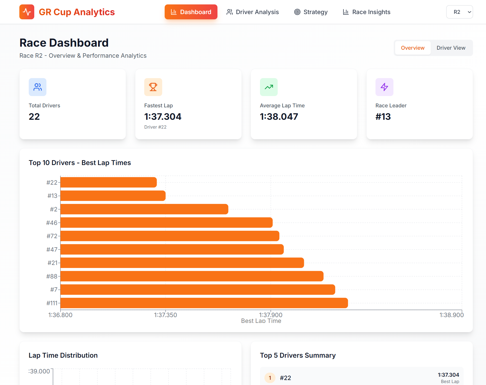

# GR Cup Analytics - Real-Time Racing Insights Platform

A comprehensive real-time analytics and strategy tool for the GR Cup Series that provides driver insights, performance analysis, racing line optimization, and pit stop strategy recommendations.



## Features

### Strategy Calculator
- Pit stop window optimization
- Tire degradation modeling
- Multi-strategy comparison
- Time gain/loss calculations

### Post-Event Analysis
- Race insights and key moments
- Driver comparison tools
- Leaderboard visualization
- Performance highlights

## Tech Stack

### Backend
- **FastAPI** - Modern Python web framework
- **Pandas** - Data processing and analysis
- **NumPy** - Numerical computations
- **Scikit-learn** - Machine learning utilities

### Frontend
- **React 18** - UI framework
- **Vite** - Build tool and dev server
- **Recharts** - Data visualization
- **React Leaflet** - Map visualization
- **Lucide React** - Icon library

## Project Structure

```
toyota/
├── backend/
│   ├── main.py                 # FastAPI application
│   ├── models/
│   │   └── schemas.py          # Pydantic models
│   ├── services/
│   │   ├── data_processor.py  # Data loading and processing
│   │   ├── analytics.py        # Analytics and insights
│   │   └── strategy.py        # Strategy calculations
│   └── requirements.txt        # Python dependencies
├── frontend/
│   ├── src/
│   │   ├── components/        # React components
│   │   │   ├── Dashboard.jsx
│   │   │   ├── DriverAnalysis.jsx
│   │   │   ├── StrategyCalculator.jsx
│   │   │   └── RaceInsights.jsx
│   │   ├── App.jsx            # Main app component
│   │   └── main.jsx           # Entry point
│   ├── package.json              # Node dependencies
│   └── vite.config.js         # Vite configuration
└── barber/                    # Race datasets
```

## Installation & Setup

### Prerequisites
- Python 3.9+
- Node.js 18+
- npm or yarn

### Quick setup and running

```bash
./start.sh
```

### Backend Setup

1. Navigate to backend directory:
```bash
cd backend
```

2. Create virtual environment (recommended):
```bash
python -m venv venv
source venv/bin/activate  # On Windows: venv\Scripts\activate
```

3. Install dependencies:
```bash
pip install -r requirements.txt
```

4. Run the backend server:
```bash
python main.py
```

The API will be available at `http://localhost:8000`

### Frontend Setup

1. Navigate to frontend directory:
```bash
cd frontend
```

2. Install dependencies:
```bash
npm install
```

3. Start development server:
```bash
npm run dev
```

The frontend will be available at `http://localhost:3000`

## API Endpoints

### Race Data
- `GET /api/races` - Get list of available races
- `GET /api/race/{race_id}/drivers` - Get drivers for a race
- `GET /api/race/{race_id}/driver/{driver_id}/laps` - Get driver lap times
- `GET /api/race/{race_id}/driver/{driver_id}/telemetry` - Get telemetry data

### Analytics
- `GET /api/race/{race_id}/driver/{driver_id}/analysis` - Comprehensive driver analysis
- `GET /api/race/{race_id}/driver/{driver_id}/racing-line` - Racing line analysis
- `GET /api/race/{race_id}/comparison?driver_ids={ids}` - Compare drivers
- `GET /api/race/{race_id}/insights` - Race insights

### Strategy
- `GET /api/race/{race_id}/strategy/pit-stop` - Calculate pit stop strategy

## Usage Examples

### View Dashboard
1. Open `http://localhost:3000`
2. Select a race from the dropdown
3. Select a driver to view their telemetry and performance

### Analyze Racing Line
1. Navigate to "Driver Analysis"
2. Select a driver
3. View current vs optimal racing line on map
4. Review improvement suggestions

### Calculate Pit Stop Strategy
1. Navigate to "Strategy"
2. Set current lap, total laps, and degradation rate
3. View recommended pit stop windows
4. Compare different strategy options

## Data Sources

Dataset: https://trddev.com/hackathon-2025/barber-motorsports-park.zip

The application uses race datasets from the `barber/` folder:
- Telemetry data (speed, throttle, braking, GPS)
- Lap time records
- Race results
- Best lap analysis

## Future Enhancements

- Real-time WebSocket updates during live races
- Machine learning models for lap time prediction
- Advanced tire degradation modeling
- Weather impact analysis
- Multi-race trend analysis
- Export reports and insights

## License

This project is developed for the Toyota Racing Development Hackathon.
MIT license
